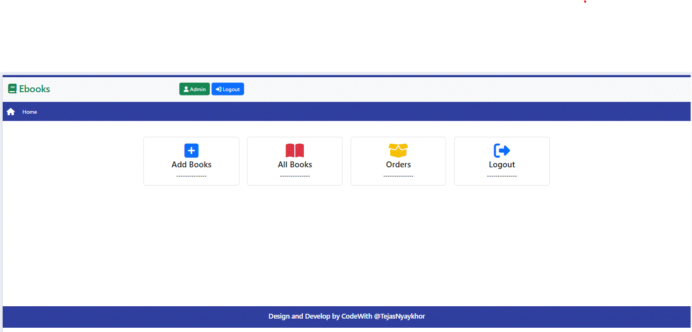
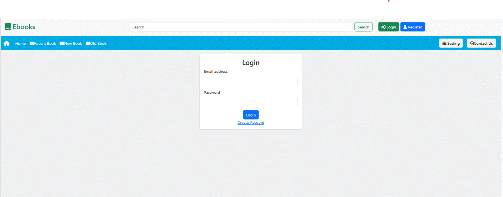

# 📚 Ebook Management System

A web application built using Java, JSP, Servlets, and MySQL to manage eBooks and user activities. Includes login, admin panel, and book management.

---

## 🚀 Features

- User Registration & Login
- Admin Panel (Add, Delete, View Books)
- Book Search Functionality
- Session Management
- Database Integration (MySQL)

---

## 🛠️ Tech Stack

- Java (JDK 8+)
- JSP + Servlets
- MySQL
- Apache Tomcat
- Bootstrap (for UI)

---

## 📸 Screenshots




---

## ⚙️ How to Run the Project

1. Clone this repository:
   ```bash
   git clone https://github.com/TejasNyaykhor/Ebook-Management-System.git
   ```

2. Import the project in Eclipse or IntelliJ as a **Maven Project**

3. Configure Tomcat Server

4. Create a MySQL DB and import `ebook.sql` from `/database/`

5. Update DB config in `config/config.properties`:
   ```properties
   db.url=jdbc:mysql://localhost:3306/ebook-app
   db.username=root
   db.password=your_password_here
   ```

6. Run the app and access it at:
   ```
   http://localhost:8080/Ebook_apk/
   ```

---

## 🔐 Default Admin Login

| Email           | Password |
|----------------|----------|
| admin@gmail.com | admin    |

---

## 🧑‍💻 Author

- [Tejas Nyaykhor](https://github.com/TejasNyaykhor)

---

## 📄 License

This project is open-sourced under the [MIT License](LICENSE)
